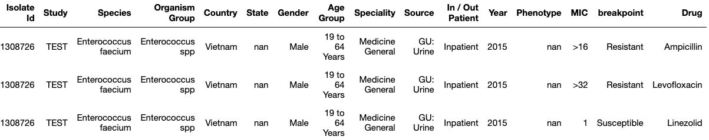

# GitTables: a large-scale corpus of relational tables.

<p align="center">
    
    <figcaption style="text-align:center">Figure 1: high-level overview of how GitTables is constructed.</figcaption>
</p>


## **Quick Links**

 <!-- prettier-ignore -->
[dataset download](https://zenodo.org/record/4943312#.YMcUlzYzZ4I){:target="_blank"} | [paper](https://arxiv.org/pdf/2106.07258){:target="_blank"} | [github repository](https://github.com/madelonhulsebos/gittables){:target="_blank"} | [video presentation](https://www.youtube.com/watch?v=jEBKcmdIFzw){:target="_blank"}


## **Quick Facts**

GitTables is a large-scale corpus of relational tables extracted from CSV files in GitHub, that facilitates learning table representation models and applications in e.g. data management, data analysis, etc. We keep expanding GitTables to at least 10M tables (ETA: early 2023).

| Statistic                                          | Value                               |
|----------------------------------------------------|-------------------------------------|
| # tables                                           | 1M                                  |
| average # columns                                  | 12                                  |
| average # rows                                     | 142                                 |
| # annotated tables (at least 1 column annotation)  | 723K+ (DBpedia), 738K+ (Schema.org) |
| # unique semantic types                            | 835 (DBpedia), 677 (Schema.org)     |


## **About GitTables**

GitTables is a large-scale corpus of 1M relational tables extracted from CSV files in GitHub. We aim at growing GitTables to at least 10M tables. Each table is distributed in its original form (e.g. with the original header), and comes with metadata like semantic type annotations of table columns. For these annotations, we used >2K different semantic types from [Schema.org](https://schema.org/){:target="_blank"} and [DBpedia](https://www.dbpedia.org/resources/ontology/){:target="_blank"}.

Figure 1 illustrates our approach to creating GitTables, on a high level.


### Why GitTables

Existing large-scale table corpora (like [WebTables](http://webdatacommons.org/webtables/){:target="_blank"}) contain tables extracted from HTML pages, limiting the capability to represent offline tables. These table corpora also lack semantic annotations, like semantic column types.

To train and evaluate table representation models for applications beyond the Web, e.g. data management, additional resources are needed with tables that resemble relational database tables. We built GitTables to facilitate that need.

Example use-cases that GitTables can facilitate that may use table representation models:

- Data search, integration, and validation.
- Data visualization and analysis recommendation.
- Schema completion for e.g. database or knowledge base design.

 
### The dataset

On average the tables have 25 columns and 209 rows, more detailed statistics can be found in the table on top of this page. Each table is stored in a parquet file and comes with metadata, in the form of the original URL, license, and table dimensions. Figure 2 shows an example table.

<p align="center">
    
    <figcaption style="text-align:center">Figure 2: example of a table retrieved based on the ``organism'' query.</figcaption>
</p>

We also annotated table columns with real-world concepts, semantic types, that the columns refer to. These labels were extracted from the DBpedia and Schema.org ontologies.

We used two different annotation methods:
- Syntactic: string-based matching between column names and the semantic types,
- Semantic: embedding semantic types and column names using a pretrained FastText model trained on the Common Crawl dataset. The annotation corresponds to the most similar semantic type.

Figure 3 presents the distribution of semantic types of the tables per annotation method and ontology.

<p align="center">
    
    <figcaption style="text-align:center">Figure 3: distribution of top 25 semantic types resulting from different annotation methods and ontologies.</figcaption>
</p>


## **Downloads**

GitTables is hosted on Zenodo which ensures long-term persistence. To facilitate extension and replication of GitTables we publish the code for extraction, curation, and annotation, as well as the ontologies used for annotation.

### Dataset downloads

The [GitHub Search API](https://docs.github.com/en/search-github/searching-on-github/searching-code){:target="_blank"} requires queries to include a keyword, which we refer to as a topic (e.g. ``id``, ``object``, etc.). We kept this structure in place so each zip file download contains the tables retrieved for a topic.

- [**GitTables 1M (16.3 GB)**](https://zenodo.org/record/6517052){:target="_blank"}: the primary corpus of 1M tables used for the analysis in the associated paper.
- [GitTables 1M - CSV files (6.8 GB)](https://zenodo.org/record/6515973){:target="_blank"}: the CSV files of which the tables were extracted.
- [GitTables benchmark - column type detection (3.6 MB)](https://zenodo.org/record/5706316){:target="_blank"}: a smaller subset of 1101 tables and associated labels used for benchmarking semantic column type detection.
- GitTables (TBC): the entire dataset of 10M tables with metadata.


### Ontology downloads
The tables have been annotated with snapshots of DBpedia and Schema.org. These ontologies are provided in the form of a pickle file. Each pickle contains a pickled Pandas DataFrame with the semantic types per ontology.

- [DBpedia ontology (509 KB)](assets/dbpedia_20210528.pkl){:target="_blank"}.
- [Schema.org ontology (619 KB)](assets/schema_20210528.pkl){:target="_blank"}.


## **Using GitTables**

For more detailed instructions for using GitTables, please check the [Usage](usage.md) page.

### License
GitTables is licensed under the [Creative Commons Attributions 4.0 International license](https://creativecommons.org/licenses/by/4.0/){:target="_blank"} (CC BY 4.0). The table data might however be licensed under different licenses as inherited from the GitHub repositories that the CSVs were retrieved from. All tables in the Zenodo dataset with version 0.0.6 have a license that allows distribution of the data. The specific license of each table is attached to the metadata in the parquet file.


### Citation
[Our paper](https://arxiv.org/pdf/2106.07258.pdf){:target="_blank"} describes the construction, analysis and use-cases of GitTables in more detail.
If you use GitTables, please cite our paper:

```
@article{hulsebos2021gittables,
   title={GitTables: A Large-Scale Corpus of Relational Tables},
   author={Hulsebos, Madelon and Demiralp, {\c{C}}a{\u{g}}atay and Groth, Paul},
   journal={arXiv preprint arXiv:2106.07258},
   url={https://arxiv.org/abs/2106.07258},
   year={2021}
}
```


## **Contact**

GitTables is developed by:
- [Madelon Hulsebos](https://madelonhulsebos.github.io){:target="_blank"}, University of Amsterdam,
- [Çağatay Demiralp](https://hci.stanford.edu/~cagatay/){:target="_blank"}, Sigma Computing,
- [Paul Groth](http://pgroth.com){:target="_blank"}, University of Amsterdam.

Please consider reporting cases of personal or otherwise undesired tables in GitTables using the form below.
Feedback, suggestions and results from projects with GitTables are also very welcome!

<form
  action="https://formspree.io/f/xzbygjng"
  method="POST"
>
  <label>
    Your email:
    <br>
    <input type="email" name="_replyto">
  </label>
  <br>
  <label>
    Your message:
    <br>
    <textarea name="message"></textarea>
  </label>
  <br>
  <button type="submit">Send</button>
</form>

\\
Alternatively, you can send an email to {{site.email}}.
