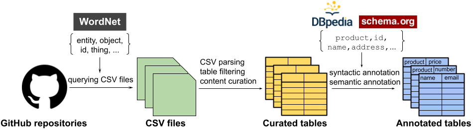

# Welcome to the website of **GitTables**!

On this page:
- [Quick links](#quick-links)
- [About GitTables](#about-gittables)
- [Downloads](#downloads)
- [License](#license)
- [Citation](#citation)
- [Contact](#contact)

## Quick links
 <!-- prettier-ignore -->
[dataset](https://zenodo.org/record/4943312#.YMcUlzYzZ4I){:target="_blank"} | [paper](https://arxiv.org/pdf/2106.07258){:target="_blank"} | [github repository](https://github.com/madelonhulsebos/gittables){:target="_blank"}


## About GitTables

GitTables is a dataset of currently 1.7M relational tables extracted from CSV files in GitHub. Our continuing curation aims at growing the dataset to at least 10M tables. Table columns in GitTables have been annotated with more than 2K different semantic types from [Schema.org](https://schema.org/){:target="_blank"} and [DBpedia](https://www.dbpedia.org/resources/ontology/){:target="_blank"}. Our column annotations consist of semantic types, hierarchical relations, range types and descriptions.

The high-level pipeline in Figure 1 illustrates how GitTables was created.

<p align="center">
    
    <figcaption style="text-align:center">Figure 1: high-level pipeline of the process of constructing GitTables.</figcaption>
</p>


### Why GitTables

Existing large-scale table corpora primarily contain tables extracted from HTML pages, limiting the capability to represent database tables. These table corpora also lack semantic annotations, like the semantic column types. 

To train and evaluate models for applications beyond the Web, additional resources are needed with tables that resemble relational database tables. We built GitTables to facilitate that need.


### The dataset

The tables in GitTables were extracted from CSV files from GitHub. On average the tables have 25 columns and 209 rows.
Each table is associated with table metadata, in the form of the original URL, license, dimensions, data types.

We also annotated table columns with real-world concepts that the columns refer to. The labels for these column annotations (referred to as semantic types) were extracted from the DBpedia and Schema.org ontologies.

We used two different annotation methods:
- Syntactic: string-based matching between column names and the semantic types,
- Semantic: embedding semantic types and column names using a pretrained FastText model trained on the Common Crawl dataset. The annotation corresponds to the most similar semantic type.

Figure 2 presents the distribution of semantic types of the tables per annotation method and ontology.

<p align="center">
    
    <figcaption style="text-align:center">Figure 2: distribution of top 25 semantic types resulting from different annotation methods and ontologies.</figcaption>
</p>


## Downloads

GitTables is hosted on Zenodo with DOI: **10.5281/zenodo.4943312**. To ensure usage, extension and replication of GitTables on the longer term, we publish the ontologies used for annotation as well. 

### Dataset downloads

The [GitHub Search API](https://docs.github.com/en/search-github/searching-on-github/searching-code){:target="_blank"} requires queries to include a keyword, which we refer to as a `topic`. We have kept this structure in place, hence each zip file consists of the tables retrieved for a `topic`.

- GitTables 1.7M: the dataset of 1.7M tables used for the analysis in the associated paper. This dataset can be found on Zenodo [**here**](https://zenodo.org/record/4943312#.YMcUlzYzZ4I){:target="_blank"} (25.5 GB).
- GitTables: the entire dataset of 10M tables with metadata (X GB). TBC.

### Ontology downloads
The tables have been annotated with snapshots of DBpedia and Schema.org. These ontologies are provided in the form of a pickle file. Each pickle contains a pickled Pandas DataFrame that can be read through Pandas.

- DBpedia ontology: direct download [**here**](downloads/dbpedia_20210528.pkl){:target="_blank"} (509 KB).
- Schema.org ontology: direct download [**here**](downloads/schema_20210528.pkl){:target="_blank"} (619 KB).


## License
GitTables is licensed under the [Creative Commons Attributions 4.0 International license](https://creativecommons.org/licenses/by/4.0/){:target="_blank"} (CC BY 4.0). The table data might however be licensed under different licenses as inherited from the GitHub repositories that the CSVs were retrieved from. 

A new version of GitTables will soon be released in which all tables have a license, and the license of each table is contained in the metadata. In the meantime, we suggest to use GitHub's License API to retrieve the license associated with a table (you can use the URL in the metadata to do so) to understand what restrictions apply to each table.


## Citation
The paper describes the construction and analysis of GitTables in more detail and can be downloaded [**here**](https://arxiv.org/pdf/2106.07258.pdf){:target="_blank"}.
If you use GitTables, please cite our paper:

```
@article{GitTables,
   title={GitTables: A Large-Scale Corpus of Relational Tables},
   author={Hulsebos, Madelon and Demiralp, Çağatay and Groth, Paul},
   journal={arXiv preprint arXiv:2106.07258},
   url={https://arxiv.org/abs/2106.07258},
   year={2021}
}
```


## Contact

GitTables has been developed by:
- [Madelon Hulsebos](https://madelonhulsebos.github.io){:target="_blank"}, University of Amsterdam,
- [Çağatay Demiralp](https://hci.stanford.edu/~cagatay/){:target="_blank"}, Sigma Computing,
- [Paul Groth](http://pgroth.com){:target="_blank"}, University of Amsterdam.

Please consider reporting cases of personal or otherwise undesired tables in GitTables using the form below.
Feedback, suggestions and results from projects with GitTables are also very welcome!

<form
  action="https://formspree.io/f/xzbygjng"
  method="POST"
>
  <label>
    Your email:
    <br>
    <input type="email" name="_replyto">
  </label>
  <br>
  <label>
    Your message:
    <br>
    <textarea name="message"></textarea>
  </label>
  <br>
  <button type="submit">Send</button>
</form>

\\
Alternatively, you can send an email to {{site.email}}.
